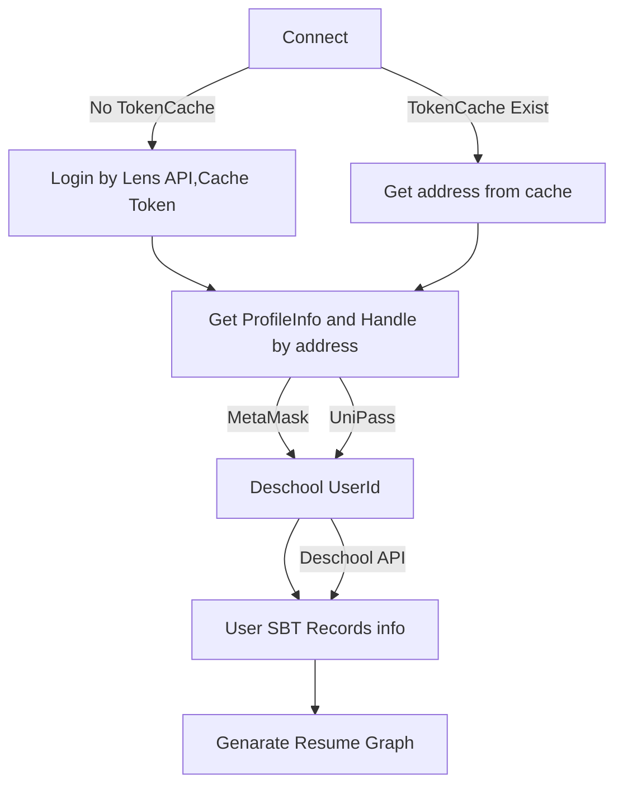

# descripbe the relationship of userinfo between lens and dechool with connect wallet steps

```mermaid
graph TD
    A[Connect] -->|No TokenCache| B[Login by Lens API,Cache Token]
    B --> C[Get ProfileInfo and Handle by address]
    A --> |TokenCache Exist| D[Get address from cache]
    D --> C
    E --> F[Connect from Deschool]
    C --> |MetaMask| E[Deschool UserId]
    C --> |UniPass| E
    E --> |Deschool API| F[User SBT Records info]
    F --> G[Genarate Resume Graph]
```
